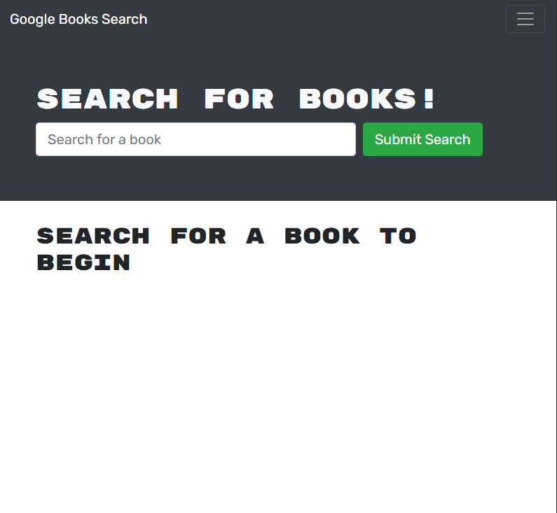

# Book Search Engine

## Description 

   A book search engine web application where books can be searched and saved for purchase. Technologies/tools used in this project are React.js, mongoDB, Node.js/Express.js, GraphQl, Apollo Server Express.

  Deployed link - https://dk777-book-search-engine.herokuapp.com/

  

## Installation

  - Clone/Download the project
  - From the `book-search-engine` directory in your terminal/command line run 'npm install'
  
## Usage 
  - Search for a book with the input form (Will not be able to save books if you're not signed in)
  - Use the login/Sign Up to register and sign in to your account
  - Use the `save this book` button to save a book (Navigate to `saved books` to view all books saved)
  - Use the `delete this book` to remove a book that was saved

## Questions
  - 👋 Hi, I’m dkbaffour777
  - GitHub profile link: [github.com/dkbaffour777/](https://github.com/dkbaffour777/)
  - 📫 How to reach, email: dkbaffour777career@gmail.com
